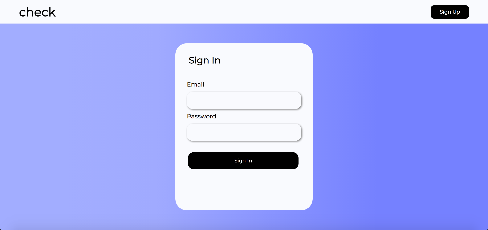
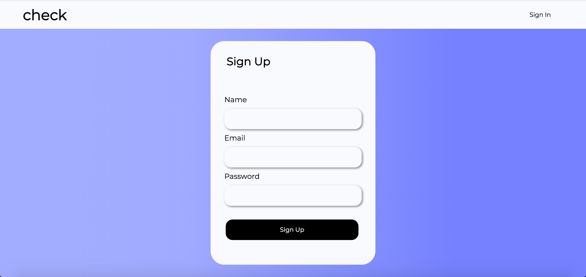
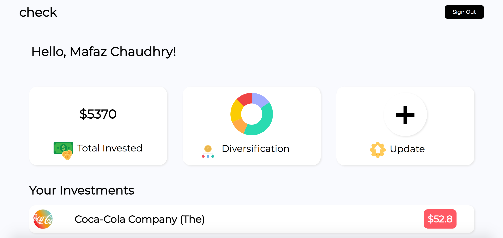
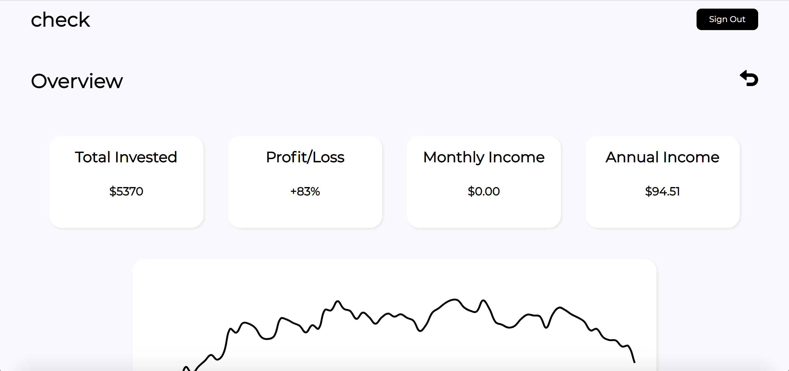
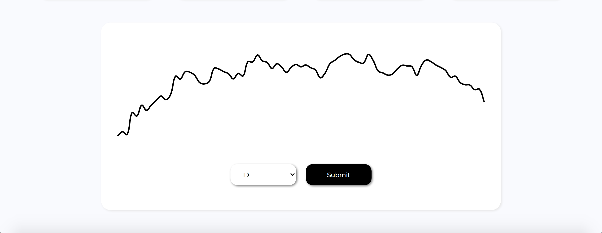
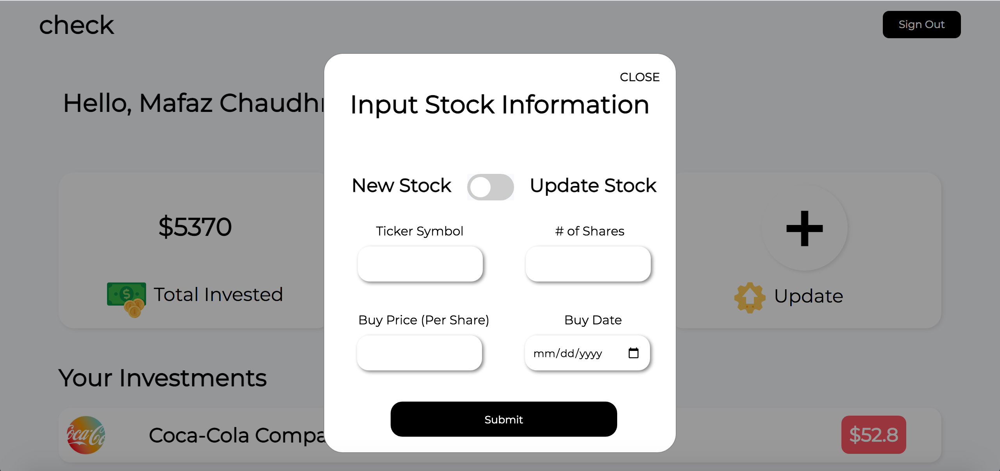
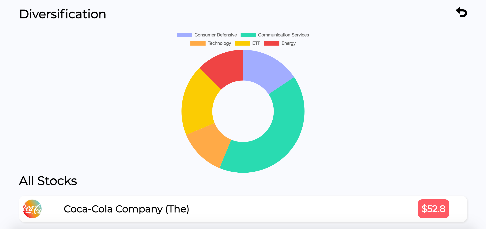
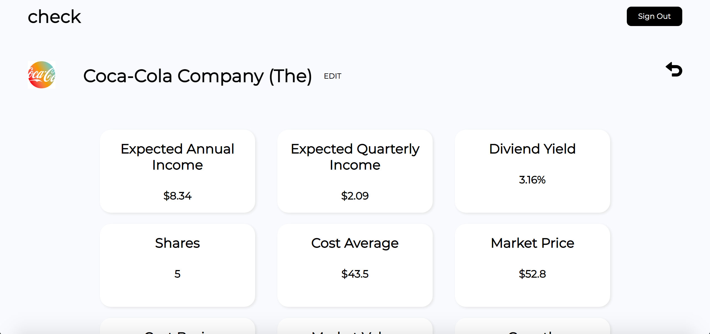
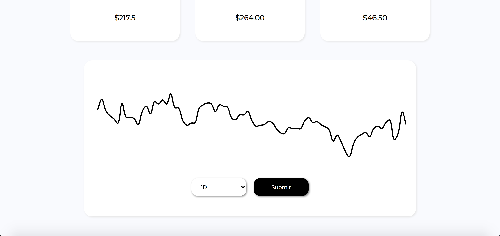

# homebase-check

 

# About check 

check is a web application that lets you track the growth of your portfolio. The user can input the stocks they own
and look at the diveristy of their portfolio at a glance. They can also see the growth of each individual stock as 
well as the whole portfolio. The project is live [here.](https://check-fintech.web.app/)

# The homebase factor 

This project implements [Homebase](https://homebase.io). Homebase makes it super easy to work on a project involving a 
backend. All you have to do is setup homebase in your project and the syncing between your database and web application 
happens through the use of Homebase's API calls. This resulted in me just having to worry about how I wanted my user 
to interact with my app and where things should be placed on the screen because I knew with Homebase's API calls I would
be able to easily access my data and put it where I needed it. 

# check snapshot

 
 
 
 
 
 
 
 
 
 

